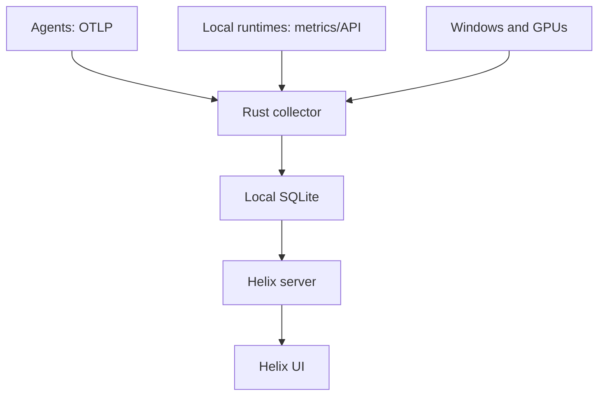

# Helix agent and inference connection design

**Status:** plan only. No collector, agent adapter, Radium export, or new
telemetry UI is implemented. Reviewed 2026-09-24 for Windows 11 with two
RTX 3090s; interfaces should remain portable.

## Current behavior

Helix does not ingest data from an operating AI agent. Its live speed and cost
measurements come from Helix-initiated xAI requests through `/api/bench` and
server functions; live calls require `XAI_API_KEY`. Browser APIs report limited
workstation information. GPU, VRAM, KV cache, and SM displays are estimates,
not hardware counters. The installer only packages these existing behaviors.

## Architecture and lifecycle

Helix's current Tauri shell launches its existing Node server only while the
window is open, on a dynamic loopback port. The eventual telemetry collector
should be a separate, small Rust per-user process. It will:

1. Receive opt-in OTLP/HTTP exports from agents on a stable loopback endpoint.
2. Poll explicitly configured local inference endpoints and sample the host.
3. Normalize events into a versioned schema and store them in local SQLite.
4. Expose only a narrow, authenticated, read-only channel to Helix's Node
   server (prefer a Windows named pipe). The iframe cannot reach native shell
   commands or provider credentials.

Start the first version when Helix opens and stop it on exit. Later, offer an
**optional per-user startup task** for recording while the window is closed;
that lifecycle and uninstall behavior need separate review. Events emitted
while the receiver is stopped may be lost, so show recording gaps honestly.

## Adapter and event contracts

Each adapter declares `sourceId`, `version`, `discovery`, `transport`,
`requiresUserSetup`, `supportedEvents`, `supportedMetrics`, `canBackfill`, and
`status`. It implements `probe()`, `start(emit)`, and `stop()`; `backfill(cursor)`
is optional. Status distinguishes unconfigured, offline, unauthorized,
unsupported, and degraded. Discovery never loads a model or runs a billable
request. Initial adapter IDs: `codex_otel`, `claude_code_otel`, `helix_xai`,
`radium_metrics`, `llamacpp_metrics`, `ollama_api`, `lmstudio_api`, and
`windows_nvidia`. A generic provider adapter covers requests Helix itself
originates; it cannot observe every client that happens to use that provider.

The versioned envelope includes `eventId`, `observedAt`, `receivedAt`,
`hostId`, `sourceId`, `client`, `provider`, `runtime`, `modelId`, `sessionId`,
`requestId`, `parentRequestId`, `kind`, `metrics`, `measurement`, `costBasis`,
`completeness`, and `provenance`. Request metrics allow nullable input,
output, cached and reasoning tokens, TTFT, duration, throughput, and USD cost.
Null means unavailable; zero means a measured zero. Other event kinds cover
tools, agent state, errors, model load, GPU samples, and service health.

Preserve timestamps and raw units before converting to milliseconds, bytes,
tokens, and USD. Counter deltas must handle resets/restarts and source-specific
reporting delays. Deduplicate by stable source event ID or deterministic hash,
never by similar timestamps. Keep the *client* separate from the *provider*:
Codex -> Radium -> llama.cpp can generate two records for one request. Link by
trace/request ID if provided; otherwise flag correlation as unverified and
include usage only once using a chosen authoritative source. Retries, reroutes,
cache hits, and parallel subagents remain visible as distinct records.

## Source capability matrix

| Source | Initial connection | What it can actually supply | Limit or next step |
| --- | --- | --- | --- |
| Codex CLI | Opt-in user-level `[otel]` OTLP export | API and tool activity, completion token counts when emitted | Test the installed desktop/IDE variants separately; an app-server event stream applies if Helix owns that client connection. Codex ignores `otel` in project-local config. |
| Claude Code | Opt-in `CLAUDE_CODE_ENABLE_TELEMETRY=1`, OTLP metrics/logs | Sessions, tokens, tools, approximate cost, errors | Metrics can arrive later than the underlying request. No prompt or tool-output collection by default. |
| Grok / xAI | Normalize Helix's existing API responses; later an opt-in provider SDK/gateway hook | Provider-reported tokens and per-request billed xAI API cost | The consumer Grok app has no verified local telemetry feed. Do not scrape its window or intercept its account session. |
| Radium | Authenticated read-only `GET /metrics?model=<id>` from its local API | llama.cpp model counters and health | Per-request inspector data is private Tauri app state; exporting it needs a separately reviewed Radium change. |
| Plain llama.cpp | Health/model endpoints; `/metrics` when explicitly enabled | Slots and runtime counters | `--metrics` defaults off; polling does not reveal historical requests. |
| Ollama | `GET /api/ps` and responses Helix itself observes | Loaded models and reported VRAM; tokens/timing for observed requests | `/api/ps` is not a history of other clients' completions. |
| LM Studio | Read-only model listing and responses Helix itself observes | Loaded model identity and observed response stats | Prefer current `/api/v1/*`; its API alone does not promise a passive history of other clients. |
| Other providers | Adapter for documented SDK/export or Helix-routed compatible requests | Metrics returned by that source | No credential extraction or implied monitoring of subscription-only clients. |

**Radium finding:** inspected `walladanger/Radium` at commit `4fb37536`.
Its Rust proxy exposes a model-targeted `/metrics` route for llama.cpp sessions.
The live request inspector stores up to 200 records in memory and emits private
`api-inspector://` Tauri events; it can contain prompt/reply previews. The first
Helix adapter must use only the authorized metrics endpoint. A later opt-in
Radium exporter should publish *metadata only* with stable request IDs and no
previews. This requires its own Radium scope and review.

## Real workstation readings

The native sampler should report CPU/RAM/process and per-device NVIDIA NVML
memory, utilization, temperature, and power, keyed by GPU UUID or PCI bus ID.
Treat the two 3090s as separate 24 GB devices; their VRAM is not one 48 GB
allocation. Windows WDDM can make per-process GPU memory unavailable in NVML.
Show unavailable rather than silently guessing. Correlation between an active
model and a GPU spike is estimated unless the runtime reports device placement.
Label each displayed value `device measured`, `runtime reported`, `request
measured`, `derived`, `estimated`, or `unavailable`; preserve the current
estimate until a functioning source replaces it visibly.

## Access, privacy, and persistence

- Source setup is opt-in. Show any Codex or Claude configuration changes before
  applying them and offer rollback; never silently edit user-level settings.
- OTLP receiver binds `127.0.0.1` and requires a per-install bearer token in
  exporter headers. Validate origin and host, limit payload size/rate, and
  disable wildcard CORS. Store credentials in Windows Credential Manager or
  an ACL-restricted equivalent. This does not claim protection against
  malicious code already running as the same Windows user.
- Allowlist observation fields before persistence. Exclude prompt text, raw
  request bodies, tool outputs, file paths, and API keys by default. A future
  diagnostic-content mode would need separate explicit consent and retention.
- Use SQLite WAL, idempotent writes, migrations, and a redacted export. Draft
  retention: 14 days of detailed observations, 90 days of rollups, configurable
  and removable per source. Send nothing to a hosted Helix service.
- A narrow read API mediates data for the existing UI. Keep Radium and LM
  Studio bearer tokens in the collector, never in the iframe or localStorage.

## Implementation order and acceptance gates

1. **Inventory on the actual machine:** record Codex variant, Claude Code
   version and config scope, Radium auth mode and loaded models, inference
   runtimes, and desired recording lifecycle. Confirm the real fields each
   installation exports before committing to displays.
2. **Contracts and fixtures:** implement adapter registry, observation schema,
   attribution rules, SQLite schema and migrations, consent settings, and
   source labels using representative official payloads.
3. **Collector prototype:** Rust per-user process, authenticated OTLP/HTTP,
   bounded queues, health state, storage, and same-user read channel. Run with
   the existing Tauri shell; test restart and unclean shutdown.
4. **First agents:** Codex CLI OTLP and Claude Code OTLP plus Helix xAI usage.
   Compare one actual session of each with its own reported totals. Verify
   tool and subagent events cannot be counted as extra model requests.
5. **Local runtimes:** authenticated Radium metrics, plain llama.cpp, Ollama,
   then LM Studio. Test two simultaneous loaded models, auth failures,
   unavailable endpoints, and interrupted streams. Design the Radium exporter
   separately before changing Radium.
6. **Device and lifecycle:** sample both GPUs and host resources, verify WDDM
   missing fields and stable GPU identity. Only then offer optional background
   startup and clear removal during uninstall.
7. **Additional providers:** add documented adapters one at a time. Exercise
   Codex -> Radium and Claude -> local runtime to verify usage is counted once.

The first release is done when a user can enable one source, see its real
connection status and a session's model/tokens/timing with provenance, restart
Helix without duplicate counts, turn collection off, and delete that source's
data. Missing measurements are shown as unavailable; secrets and prompt/tool
content never enter the normal store or export.

## Decisions for the implementation kickoff

- Should collection continue with Helix closed? That requires the optional
  per-user startup task and a change to installer/uninstaller behavior.
- Which Codex surfaces are essential: CLI, desktop, IDE, or sessions that
  Helix starts through app-server? Each must be verified independently.
- Is Radium read-only health enough for the first build, or are per-request
  measurements from other clients required? The latter needs a Radium export.
- Are the NAS and other networked machines in scope? This version stays on
  one PC; remote enrollment is a separate feature.

## Source references

- Codex OTel and app-server events: <https://developers.openai.com/codex/config-advanced>,
  <https://developers.openai.com/codex/app-server>.
- Claude Code telemetry and privacy controls:
  <https://code.claude.com/docs/en/monitoring-usage>.
- xAI usage and billed request cost: <https://docs.x.ai/developers/cost-tracking>.
- llama.cpp metrics: <https://github.com/ggml-org/llama.cpp/blob/master/tools/server/README.md>.
- Ollama statistics and loaded models: <https://docs.ollama.com/api/generate>,
  <https://docs.ollama.com/api/ps>.
- LM Studio API: <https://lmstudio.ai/docs/developer/rest>.
- NVIDIA NVML WDDM limits:
  <https://docs.nvidia.com/deploy/nvml-api/api/structnvmlProcessInfo__t.html>.
- Radium code: <https://github.com/walladanger/Radium/blob/main/src-tauri/src/core/server/proxy.rs>,
  <https://github.com/walladanger/Radium/blob/main/src-tauri/src/core/server/request_inspector.rs>.
