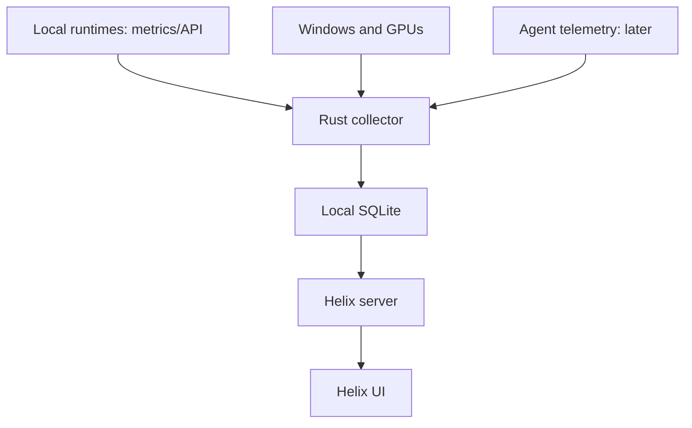

# Helix local inference monitoring and agent connection design

**Status:** plan only. No collector, agent adapter, Radium export, or new
telemetry UI is implemented. Reviewed 2026-09-24 for Windows 11 with two
RTX 3090s; interfaces should remain portable.

## Product priority

**Primary:** measure and improve inference on this workstation: Radium,
llama.cpp, LM Studio, Ollama, and other local servers, correlated with actual
CPU, RAM, and each GPU. The first release must work without Codex, Claude,
Grok, an API key, or internet access. The existing Helix xAI benchmark remains
an optional cloud feature; it is not the default success path.

**Secondary:** attribute local inference to whichever app requested it
(Codex, Claude Code, Radium's chat UI, another agent) when supported. Only
then add telemetry for their remote-provider usage. A locally installed agent
is not itself a local inference runtime: Codex -> Radium is local inference;
Codex -> a hosted model is remote inference.

## Current behavior

Helix does not ingest data from an operating AI agent. Its live speed and cost
measurements come from Helix-initiated xAI requests through `/api/bench` and
server functions; live calls require `XAI_API_KEY`. Browser APIs report limited
workstation information. GPU, VRAM, KV cache, and SM displays are estimates,
not hardware counters. The installer only packages these existing behaviors.

## Architecture and lifecycle

Helix's current Tauri shell launches its existing Node server only while the
window is open, on a dynamic loopback port. The eventual telemetry collector
should be a separate, small Rust per-user process. It will:

1. Discover and poll explicitly configured local inference endpoints, read
   their responses/metrics when available, and sample the host at low cost.
2. Later, receive opt-in OTLP/HTTP exports from agents on a stable loopback
   endpoint to attribute requests to clients.
3. Normalize events into a versioned schema and store them in local SQLite.
4. Expose only a narrow, authenticated, read-only channel to Helix's Node
   server (prefer a Windows named pipe). The iframe cannot reach native shell
   commands or provider credentials.

Start the first version when Helix opens and stop it on exit. Later, offer an
**optional per-user startup task** for recording while the window is closed;
that lifecycle and uninstall behavior need separate review. Events emitted
while the receiver is stopped may be lost, so show recording gaps honestly.

## Adapter and event contracts

Each adapter declares `sourceId`, `version`, `discovery`, `transport`,
`requiresUserSetup`, `supportedEvents`, `supportedMetrics`, `canBackfill`, and
`status`. It implements `probe()`, `start(emit)`, and `stop()`; `backfill(cursor)`
is optional. Status distinguishes unconfigured, offline, unauthorized,
unsupported, and degraded. Discovery never loads a model or runs a billable
request. Initial adapter IDs: `radium_metrics`, `llamacpp_metrics`,
`ollama_api`, `lmstudio_api`, `vllm_metrics`, and `windows_nvidia`. Later
adapters: `codex_otel`, `claude_code_otel`, and `helix_xai`. A generic provider
adapter covers requests Helix itself originates; it cannot observe every
client that happens to use that provider.

The versioned envelope includes `eventId`, `observedAt`, `receivedAt`,
`hostId`, `sourceId`, `client`, `provider`, `runtime`, `modelId`, `sessionId`,
`requestId`, `parentRequestId`, `kind`, `metrics`, `measurement`, `costBasis`,
`completeness`, and `provenance`. Request metrics allow nullable input,
output, cached and reasoning tokens, TTFT, duration, throughput, and USD cost.
Null means unavailable; zero means a measured zero. Other event kinds cover
tools, agent state, errors, model load, GPU samples, and service health.

Preserve timestamps and raw units before converting to milliseconds, bytes,
tokens, and USD. Counter deltas must handle resets/restarts and source-specific
reporting delays. Deduplicate by stable source event ID or deterministic hash,
never by similar timestamps. Keep the *client* separate from the *provider*:
Codex -> Radium -> llama.cpp can generate two records for one request. Link by
trace/request ID if provided; otherwise flag correlation as unverified and
include usage only once using a chosen authoritative source. Retries, reroutes,
cache hits, and parallel subagents remain visible as distinct records.

## Local inference performance contract

The primary screen answers: **which model is running, on which device, how
fast, what is limiting it, and how did a change affect it?** Prefer runtime
instrumentation for request facts and OS/device sampling for machine state.

| Group | Priority measurements | Collection rule |
| --- | --- | --- |
| Model and runtime | Model ID, quantization, loaded state, backend, configured context and compute device | Read runtime APIs; never infer the model solely from GPU activity. |
| Response | Input/output tokens, prefill speed, TTFT, decode speed, duration, errors, cache reuse | Per-request facts need actual response/request events; label `/metrics` counters as aggregates. |
| Scheduler and KV | Queued/active requests, slots, context used, KV occupancy, prefix cache hits, speculative acceptance | Keep each runtime's own definitions and label missing fields unavailable. |
| Hardware | VRAM, GPU load, power, temperature on each card, CPU/RAM, process where reliable | Sample with timestamps and stable GPU UUID or PCI bus ID. |
| Efficiency | Speed versus utilization/power, joules per output token, before/after comparison | Derive only from synchronized valid samples and show the comparison settings. |

TTFT must state whether it begins at client send or server accept and end at
the first *content* token. Decode speed excludes prefill only when the source
actually separates it. An SSE chunk can contain multiple tokens, so an
inter-chunk gap is not automatically TPOT. Mark partial streams, aborts and
concurrent requests; do not invent a speed for missing token counts. Use
monotonic clocks for measured intervals and wall time for cross-process events.

Target bounded device sampling at 1 second while active and 5 seconds idle,
with configurable intervals and chart downsampling. Request timing comes from
request events, not the GPU sampler. Apply short timeouts and backoff to
pollers; measure collector CPU/RAM overhead and dropped samples. Keep passive
observation separate from an explicit, on-demand local benchmark recording
prompt profile, context, concurrency and warm versus cold start. Discovery
and ordinary monitoring must never start inference traffic.

### Guided local optimization

The monitoring data should drive a **repeatable tuning loop**, not just live
gauges: capture a baseline, change one documented runtime setting, rerun the
same prompt/context/concurrency profile, and compare median plus tail TTFT,
prefill/decode speed, memory headroom, and power. Keep run configuration and
hardware/driver/backend versions with each result so changes are attributable.
Warm and cold starts are separate experiments; concurrent requests need their
own workload class.

Start with advisory diagnostics for CPU fallback, low GPU offload, VRAM
pressure, queue saturation, KV/cache contention, and asymmetric 3090 usage.
Later, gate adapter-specific suggestions for context length, GPU layer/offload,
KV format, flash attention, batch/parallel settings, and speculative decoding
on the runtime's documented capabilities. Give each suggestion the observed
evidence, predicted tradeoff, and a reversible comparison step. Never assume
that two 24 GB cards automatically offer a contiguous 48 GB allocation.
Helix must not silently rewrite a model server's settings or load/unload
models to "optimize" them; any future apply/rollback control is a separately
scoped feature.

## Source capability matrix

| Source | Initial connection | What it can actually supply | Limit or next step |
| --- | --- | --- | --- |
| Radium | Authenticated read-only `GET /metrics?model=<id>` from its local API | llama.cpp model counters and health | Per-request inspector data is private Tauri app state; exporting it needs a separately reviewed Radium change. |
| Plain llama.cpp | Health/model endpoints; `/metrics` when explicitly enabled | Slots and runtime counters | `--metrics` defaults off; polling does not reveal historical requests. |
| Ollama | `GET /api/ps` and responses Helix itself observes | Loaded models and reported VRAM; tokens/timing for observed requests | `/api/ps` is not a history of other clients' completions. |
| LM Studio | Read-only model listing and responses Helix itself observes | Loaded model identity and observed response stats | Prefer current `/api/v1/*`; its API alone does not promise a passive history of other clients. |
| vLLM | Read-only Prometheus `/metrics` | KV occupancy, token counters and latency distributions | Aggregate histograms do not reconstruct each request. |
| Codex CLI (later) | Opt-in user-level `[otel]` OTLP export | API and tool activity, completion token counts when emitted | Test desktop/IDE variants separately; app-server events apply when Helix owns the client. |
| Claude Code (later) | Opt-in `CLAUDE_CODE_ENABLE_TELEMETRY=1`, OTLP metrics/logs | Sessions, tokens, tools, approximate cost, errors | Metrics can lag; no prompt/tool output by default. |
| Grok / xAI (later) | Normalize Helix's existing API responses; later opt-in SDK/gateway hook | Provider-reported tokens and billed API cost | Consumer Grok app has no verified local telemetry feed. |
| Other providers | Adapter for documented SDK/export or Helix-routed compatible requests | Metrics returned by that source | No credential extraction or implied monitoring of subscription-only clients. |

**Radium finding:** inspected `walladanger/Radium` at commit `4fb37536`.
Its Rust proxy exposes a model-targeted `/metrics` route for llama.cpp sessions.
The live request inspector stores up to 200 records in memory and emits private
`api-inspector://` Tauri events; it can contain prompt/reply previews. The first
Helix adapter must use only the authorized metrics endpoint. An opt-in Radium
exporter is an **early local inference milestone**: it can supply per-request
speed and attribution from other clients. It should publish *metadata only*
with stable request IDs and no previews. Design and review that separate Radium
change before building it.

## Real workstation readings

The native sampler should report CPU/RAM/process and per-device NVIDIA NVML
memory, utilization, temperature, and power, keyed by GPU UUID or PCI bus ID.
Treat the two 3090s as separate 24 GB devices; their VRAM is not one 48 GB
allocation. Windows WDDM can make per-process GPU memory unavailable in NVML.
Show unavailable rather than silently guessing. Correlation between an active
model and a GPU spike is estimated unless the runtime reports device placement.
Label each displayed value `device measured`, `runtime reported`, `request
measured`, `derived`, `estimated`, or `unavailable`; preserve the current
estimate until a functioning source replaces it visibly.

## Access, privacy, and persistence

- Source setup is opt-in. Show any Codex or Claude configuration changes before
  applying them and offer rollback; never silently edit user-level settings.
- OTLP receiver binds `127.0.0.1` and requires a per-install bearer token in
  exporter headers. Validate origin and host, limit payload size/rate, and
  disable wildcard CORS. Store credentials in Windows Credential Manager or
  an ACL-restricted equivalent. This does not claim protection against
  malicious code already running as the same Windows user.
- Allowlist observation fields before persistence. Exclude prompt text, raw
  request bodies, tool outputs, file paths, and API keys by default. A future
  diagnostic-content mode would need separate explicit consent and retention.
- Use SQLite WAL, idempotent writes, migrations, and a redacted export. Draft
  retention: 14 days of detailed observations, 90 days of rollups, configurable
  and removable per source. Send nothing to a hosted Helix service.
- A narrow read API mediates data for the existing UI. Keep Radium and LM
  Studio bearer tokens in the collector, never in the iframe or localStorage.

## Implementation order and acceptance gates

1. **Inventory the local machine:** verify Radium's actual auth and `/metrics`
   response, installed llama.cpp/LM Studio/Ollama/vLLM versions, loaded models,
   NVML support and both GPU identities. Identify which request metrics each
   runtime can expose passively, and record gaps before building the UI.
2. **Local contracts and fixtures:** versioned runtime/device observation
   schema, per-request versus aggregate semantics, counter-reset handling,
   SQLite migrations and benchmark profiles. Use captured official-format
   fixtures; no Codex or cloud credentials are needed for this stage.
3. **Local collector MVP:** Rust per-user process, read-only Radium and plain
   llama.cpp endpoints, per-GPU NVML/Windows samples, bounded timeouts/queues,
   local store and same-user read channel. Connect to Helix without changing
   Radium. Test with two loaded models and no internet connection.
4. **Local inference first release:** add Ollama, LM Studio and vLLM adapters,
   passive charts, visible provenance and missing-data states. Add an
   on-demand benchmark that can target a selected local endpoint; record
   model, prompt profile, context, warm/cold state and concurrency so runs can
   be compared honestly. Include an evidence-backed, advisory before/after
   tuning view. Validate simultaneous activity on both 3090s.
5. **Rich Radium telemetry:** design the metadata-only opt-in exporter from
   Radium's request inspector as a *separate* scoped change, review its
   security/compatibility, then implement it if approved. Use this to capture
   real request timing from Radium clients without injecting benchmark traffic.
6. **Agent attribution second:** add Codex CLI and Claude Code OTLP adapters
   after local inference is stable. Verify Codex -> Radium and Claude -> local
   runtime; prevent double counting. Test their own cloud requests separately.
7. **Cloud providers last:** normalize Helix's xAI usage and add optional
   provider SDK/gateway adapters where documented. No dependence on them for
   startup or local monitoring. Offer background collection only after startup,
   resource cost, consent and uninstall behavior are reviewed.

The **first local release** is done when Helix can run offline, discover at
least one running local backend, show its model and live throughput/queue or
slot metrics where exposed, graph both 3090s separately, record an explicitly
launched comparable local benchmark, survive an app restart without duplicate
counts, and make unsupported fields plainly unavailable. It must not request
an xAI key, start an agent, load a model unexpectedly, or send benchmark
traffic during ordinary observation. A later agent-connection release adds
client attribution and source-specific token/cost accounting.

## Decisions for the implementation kickoff

- Should collection continue with Helix closed? That requires the optional
  per-user startup task and a change to installer/uninstaller behavior.
- Which local runtime should be validated first after Radium and plain
  llama.cpp: the installed LM Studio or Ollama instance? Probe the PC to decide.
- For passive activity from other Radium clients, is the separate metadata-only
  Radium export desired after the read-only MVP? This is the path to reliable
  per-request request timing from Radium without routing all traffic through
  Helix.
- Which Codex surfaces matter when agent attribution begins: CLI, desktop,
  IDE, or Helix-managed app-server sessions? Verify each independently.
- Are the NAS and other networked machines in scope? This version stays on
  one PC; remote enrollment is a separate feature.

## Source references

- Codex OTel and app-server events: <https://developers.openai.com/codex/config-advanced>,
  <https://developers.openai.com/codex/app-server>.
- Claude Code telemetry and privacy controls:
  <https://code.claude.com/docs/en/monitoring-usage>.
- xAI usage and billed request cost: <https://docs.x.ai/developers/cost-tracking>.
- llama.cpp metrics: <https://github.com/ggml-org/llama.cpp/blob/master/tools/server/README.md>.
- Ollama statistics and loaded models: <https://docs.ollama.com/api/generate>,
  <https://docs.ollama.com/api/ps>.
- LM Studio API: <https://lmstudio.ai/docs/developer/rest>.
- vLLM production metrics: <https://docs.vllm.ai/en/latest/design/metrics/>.
- NVIDIA NVML WDDM limits:
  <https://docs.nvidia.com/deploy/nvml-api/api/structnvmlProcessInfo__t.html>.
- Radium code: <https://github.com/walladanger/Radium/blob/main/src-tauri/src/core/server/proxy.rs>,
  <https://github.com/walladanger/Radium/blob/main/src-tauri/src/core/server/request_inspector.rs>.
